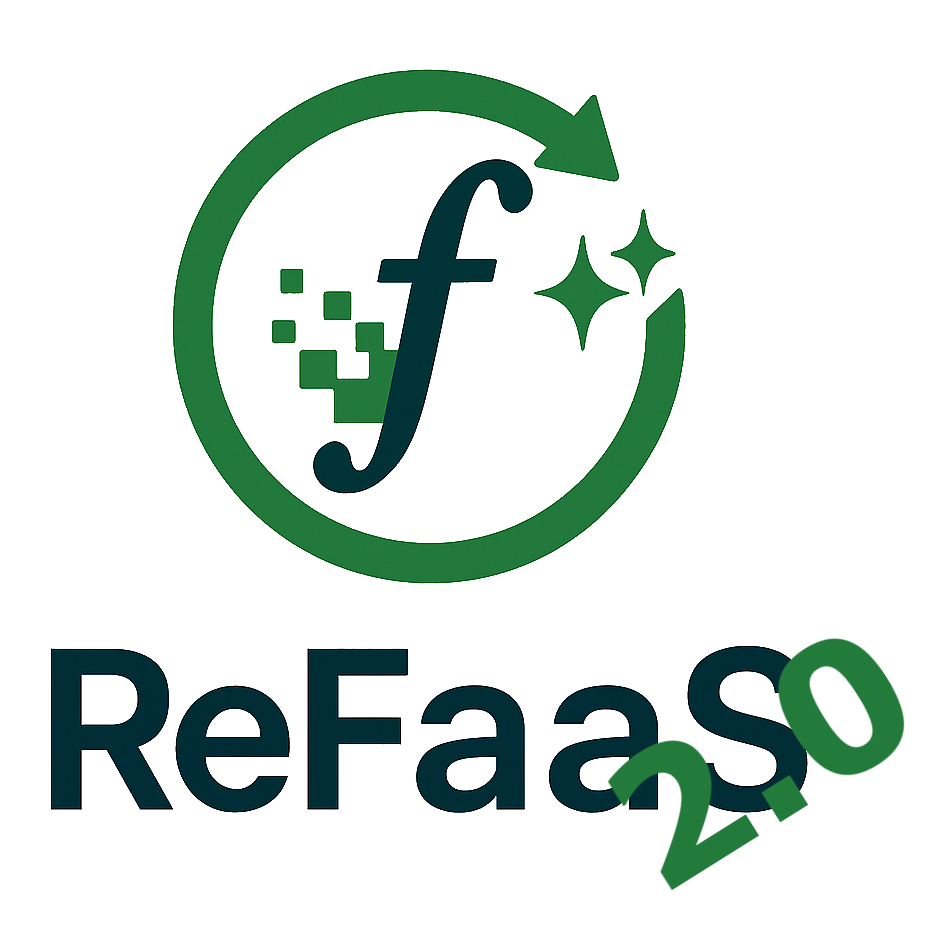
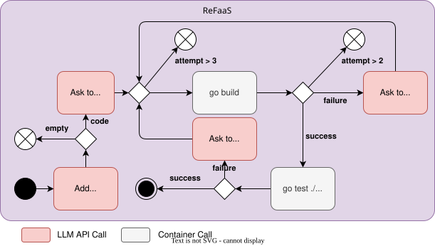

| `PYSCAN_PYTHON` |<div id="top">

<!-- HEADER STYLE: CLASSIC -->
<div align="center">




<em>A service for rewriting FaaS Functions into more energy efficient versions.</em>

<!-- BADGES -->
<em>Built with the tools and technologies:</em>


</div>
<br>

---

## Table of Contents

- [Table of Contents](#table-of-contents)
- [Overview](#overview)
  - [Pipeline Overview](#pipeline-overview)
  - [Architecture](#architecture)
  - [📚 API Endpoints](#-api-endpoints)
  - [📦 Data Structures](#-data-structures)
      - [ConversionRequest](#conversionrequest)
      - [ConverterOptions](#converteroptions)
  - [⚡ Additional Notes](#-additional-notes)
- [Getting Started](#getting-started)
  - [Prerequisites](#prerequisites)
  - [Usage](#usage)
- [Docker](#docker)
  - [🧪 Example Usage](#-example-usage)
    - [1. Upload a File](#1-upload-a-file)
    - [2. Check if a Job Exists](#2-check-if-a-job-exists)
    - [3. Download the Converted Package](#3-download-the-converted-package)
    - [4. Stop a Running Conversion](#4-stop-a-running-conversion)
    - [5. Retrieve All Metrics](#5-retrieve-all-metrics)
    - [6. Reconfigure the Pipeline](#6-reconfigure-the-pipeline)

---

## Overview

The ReFaaS transforms serverless functions from one language to another (e.g., Python → Go) using a configurable AI-assisted pipeline. Upload a `.zip` file, and retrieve the converted package once processing is complete.

---

### Pipeline Overview
The conversion pipeline consists of several tasks, each with its own retry logic and validation steps. The tasks are executed in a sequence or conditionally based on the results of previous tasks.

An example pipeline configuration is provided in the [Example Usage](#5-reconfigure-the-pipeline) section and in the following figure.

<center>


</center>

For more details check out [internal/pipeline/pipeline.go](internal/pipeline/pipeline.go) and [internal/pipeline/pipeline_io.go](internal/pipeline/pipeline_io.go). Default task registrations live in [internal/translator/prompts.go](internal/translator/prompts.go) and [internal/builder/builder.go](internal/builder/builder.go).

### Architecture

The codebase follows Standard Go Project Layout with a thin entrypoint and internal packages:

- **cmd/refaas**: service entrypoint.
- **internal/pipeline**: pipeline orchestration, task registry, and config parsing.
- **internal/llmconnector**: LLM client abstractions and provider implementations.
- **internal/translator**: prompt rendering, LLM translation, and response parsing.
- **internal/builder**: build/compile/test stages and output validation.
- **internal/pyscan**: deterministic, LLM-free Python source analysis - the `pyScan` stage. Produces both the translate prompt's library/construct hints and the fixed-width numeric feature vector the prediction work is built on.
- **evaluation/harness**: the two measurement harnesses (Python and Go) used by `cmd/runtime` for the Go-vs-Python energy comparison; kept in one package so the two sides cannot drift apart.
- **internal/fixture**: the canonical test-fixture schema shared by `goTester` and `flociTester` (legacy `input`/`output` fixtures are lowered into it automatically).
- **internal/inputhandler**: zip input parsing and normalization.
- **internal/outputhandler**: zip output writing and HTTP error reporting.
- **internal/service**: HTTP API and background processing.

### 📚 API Endpoints

| Endpoint | Method | Request | Response | Description |
|:---|:---|:---|:---|:---|
| `/` | POST | Multipart form with field `file` (`.zip`, max 50MB) | `201 Created` + job UUID in the response body<br/>Errors: `400` (unreadable or invalid package — no source file, no `test/` fixtures, unparseable fixture, or missing `meta.json` in benchmark mode), `415`, `503` (queue full), `500` | Upload a serverless function `.zip` for conversion. The package is validated up front, so a doomed job never spends LLM budget. |
| `/{uuid}` | HEAD | - | `200 OK` if job exists<br/>`404 Not Found` if job unknown | Check if a submitted conversion job exists. |
| `/{uuid}` | GET | - | `200 OK` + Converted `.zip` file if completed<br/>`406 Not Acceptable` if not completed<br/>`404 Not Found` if unknown<br/>`500 Internal Server Error` on error | Download the converted serverless function package by UUID. |
| `/stop/{uuid}` | POST | - | `202 Accepted` if the job was queued or running<br/>`404 Not Found` if unknown or already finished | Cancel a queued or in-progress conversion so it stops spending further build/test/LLM resources. |
| `/metrics` | GET | - | `200 OK` + JSON with metrics | Retrieve conversion processing metrics for all jobs. |
| `/reconfigure` | POST | JSON body with `ConverterOptions` | `201 Created` on success<br/>`500 Internal Server Error` on failure | Reconfigure the conversion pipeline at runtime. |
| `/predict` | POST | Multipart form with field `file` (same `.zip` as `/`) | `200 OK` + JSON `{function_id, score, threshold, translate, model, features}`<br/>`501 Not Implemented` when prediction is disabled (the default)<br/>Errors: `400`, `415`, `500` | Score an artifact's translatability **without translating it** — no job is queued and no LLM token is spent. The answer is the one the `predictGate` stage would act on, since both go through the same scorer. |

---

### 📦 Data Structures

##### ConversionRequest
```json
{
  "id": "string (UUID)",
  "sourcePackage": "DeploymentPackage (optional)",
  "workingPackage": "DeploymentPackage (optional)",
  "metrics": "Metrics (optional)",
  "completed": "boolean"
}
```

##### ConverterOptions
Configures both the LLM backend and the conversion pipeline. `options`/`tasks` define the pipeline directly on this object (no nested wrapper) and share their shape with `internal/pipeline.PipelineFile`.

`args`, `options`, and `task_args` look similar but scope to different things and live for different amounts of time. Use this as the lookup table instead of re-deriving it from the code:

| Name (JSON key) | Go type | Scope | Set when | Consumed by |
|:---|:---|:---|:---|:---|
| `args` | `ConverterOptions.Args` | Connector wiring (API keys, endpoints) | Once, at Runner build / `/reconfigure` | `llmconnector.Client.Configure` |
| `options` | `PipelineFile.Options` | Pipeline-wide defaults for every task (model_name, temperature, ...) | Once, at pipeline compile | Merged into every task's params |
| `task_args` | `ConversionTaskStub.TaskArgs` | This task only — overrides `options` | Once, at pipeline compile | Merged on top of `options` for this task's `task` converter (not `canApply`/`validation`) |
| *(unnamed — internally "task params")* | merged `options` + `task_args` | This task, every run | Fresh before every task execution, including retries | `llmconnector.Client.Prepare` |

In short: `args` answers "how do I reach the LLM backend," `options`/`task_args` answer "what should this LLM call's parameters be" — the former is set once per connector, the latter is re-merged per task on every attempt.

```json
{
  "LLMClient": "string",
  "args": { "key": "value" },
  "options": {
    "model_name": "string",
    "temperature": "float",
    "top_p": "float",
    "num_ctx": "integer"
  },
  "tasks": [
    {
      "id": "string",
      "task": "string",
      "task_args": { "key": "value" },
      "maxRetryCount": "integer",
      "validation": "string",
      "canApply": "string",
      "recovery": "string",
      "next": ["string"]
    }
  ]
}
```

**Key Elements:**
- `LLMClient` / `args`: selects and configures the LLM backend (`ollama`, `gemini`, or `chatai`). `args` is merged with environment-derived defaults (e.g. `OLLAMA_API_URL`, `GEMINI_API_KEY`, `ACADEMIC_CLOUD_ENDPOINT`, `ACADEMIC_CLOUD_API_KEY`) — see [internal/pipeline/defaults.go](internal/pipeline/defaults.go).
- `options`: Settings for the LLM model and inference behavior, merged into every task unless overridden by that task's own `task_args`.
- `tasks`: A list of tasks executed sequentially or conditionally, each with retry logic, validation, and recovery tasks.

The same `options`/`tasks` shape is used standalone for the embedded default pipeline in [internal/pipeline/default.yaml](internal/pipeline/default.yaml). A full `ConverterOptions` JSON example is available in default.json at the repository root.

---

### ⚡ Additional Notes

- **Upload size limit**: Maximum 50MB file size.
- **Accepted format**: Only `.zip` files.
- **Job expiration**: Jobs are deleted **after download** or **server restart**.
- **Concurrency**: A background worker sequentially processes uploaded jobs.
- **Test fixtures**: The canonical fixture schema is the rich, side-effect-aware shape (`payload`/`expectedOutput`/`outputMode`/`setup`/`sideEffects`, defined in [internal/fixture](internal/fixture/testcase.go) and documented in [docs/floci-integration.md](docs/floci-integration.md)); both `goTester` and `flociTester` parse it. Legacy black-box fixtures (`input`/`output` JSON strings) keep working — they are lowered into the canonical shape automatically. New fixtures should be authored in the rich shape only.
- **Cancellation**: `POST /stop/{uuid}` cancels a queued or in-progress job; the pipeline aborts at the next opportunity (between retries/tasks) rather than continuing to spend build/test/LLM resources on it.
- **Pipeline Config**: The service supports **dynamic reconfiguration** without restarting.

---

## Getting Started

### Prerequisites

This project requires the following dependencies:

- **Programming Language:** Go
- **Package Manager:** Go modules

### Usage

Run the project with:

**Using [go modules](https://golang.org/):**
```sh
go run ./cmd/refaas
```

## Docker

Start the service using Docker Compose. Copy the example env file and update secrets before running:

```sh
cp .env.example .env
# Edit .env and set your keys (e.g. GEMINI_API_KEY)
docker compose up --build
```

The compose file exposes port `8080` on the host. Replace `OLLAMA_API_URL` in `.env` to point to a running Ollama instance if you use the `ollama` backend.

If you need a local Ollama server, enable the optional `ollama` service in `docker-compose.yml` and adjust `OLLAMA_API_URL` accordingly.

### Optional: Floci integration testing

An optional pipeline stage (`flociTester`) can deploy a translated function as a
real Lambda inside a local [Floci](https://floci.io) AWS emulator and validate
both its response **and** AWS side effects (S3 objects, DynamoDB items, …). It is
fully opt-in — disabled by default, the existing build/test behavior is
unchanged.

```sh
# Start refaas + ollama + the Floci emulator (profile-gated):
docker compose --profile floci up --build
# Switch to a pipeline that enables Floci and includes the stage:
./scripts/reconfigure.sh examples/floci/pipeline-bundled.json
```

Enable it with `floci.enabled=true` (in a `/reconfigure` body) or
`FLOCI_ENABLED=true`. See [docs/floci-integration.md](docs/floci-integration.md)
for test-case format, the built-in S3/DynamoDB checkers, and how to add new
assertion types.

### Ex-ante prediction gate (optional, off by default)

The `predictGate` stage scores an uploaded function's static feature vector
*before the first LLM call* and can decline candidates it expects to fail. Like
Floci it is fully opt-in: with `predict.enabled` unset the stage is a no-op and
every existing measurement stays reproducible.

The model is fitted offline (`evaluation/prediction/`, scikit-learn) and shipped
as a JSON vector of coefficients, so `go.mod` gains no ML dependency and
`internal/predictor` is a reader — the same separation `cmd/energy` keeps for its
constants. `internal/predictor`'s parity test scores the whole corpus against
scikit-learn's own probabilities and requires agreement to 1e-9, so the deployed
classifier is provably the one that was evaluated.

```sh
# 1. export a model from the offline evaluation
python3 evaluation/prediction/evaluate.py \
    --dataset evaluation/prediction/dataset-20260831-190900.csv \
    --export-model evaluation/prediction/model-20260831-190900.json

# 2. run with the gate scoring every job but changing no outcome
PREDICT_ENABLED=true PREDICT_MODEL=evaluation/prediction/model-20260831-190900.json \
    go run ./cmd/refaas

# 3. score an artifact without translating it
curl -X POST -F file=@evaluation/evaluation_set/f1.zip http://localhost:8080/predict

# or apply the shipped pipeline that includes the stage
./scripts/reconfigure.sh scripts/predict.json
```

`PREDICT_ENFORCE=true` (or `predict.enforce`) makes a below-threshold score
actually stop the job, which the pipeline reports as a `domain.PredictionSkip`
and `cmd/energy` counts apart from failed attempts — a skip spent no tokens.
**Leave enforcement off for any run whose numbers are meant to be comparable to
the existing baselines**: an enforcing gate changes the denominator, and it
destroys the "would this have succeeded?" evidence for exactly the functions it
refuses. Scoring without enforcing records the decision either way, which is how
a deployment grows the labelled corpus over time.

The `predictGate` task must be a descendant of `pyScan` — it reads the vector
that stage records rather than scanning again, which is what keeps its marginal
cost the inference alone (~1.6 mJ against a translation's ~16 kJ). It fails
closed rather than passing a job through when the model or the vector is
missing.


This will start the service running on port 8080. However, for isolation, it is recommended to run the service in a Docker container, see [Docker](#docker) for more details.

**🛠️ Environment Variables**

| Variable | Default | Description |
|:---|:---|:---|
| `OLLAMA_API_URL` | `http://localhost:11434` | URL for connecting to Ollama LLM API. |
| `GEMINI_API_KEY` | `"NOT+SET"` | API key for Gemini LLM (optional if not using Gemini backend). |
| `ACADEMIC_CLOUD_ENDPOINT` | `https://chat-ai.academiccloud.de/v1` | Base URL for the GWDG/AcademicCloud Chat AI API (`chatai` backend). |
| `ACADEMIC_CLOUD_API_KEY` | `"NOT+SET"` | API key for the Chat AI backend (optional if not using `chatai`). |
| `APP_PORT` | `8080` | Port the service listens on. |
| `LLM_CALL_INTERVAL` | `0s` | Minimum delay enforced between LLM calls across all jobs (`"0s"` disables the throttle); a duration string like `"2s"`/`"500ms"`. |
| `FLOCI_ENABLED` | `false` | Enables the optional `flociTester` pipeline stage (`true`/`1`); see [Optional: Floci integration testing](#optional-floci-integration-testing). |
| `FLOCI_ENDPOINT` | `http://localhost:4566` | Endpoint of the Floci AWS emulator, when enabled. |
| `FLOCI_REGION` | `us-east-1` | AWS region used for the Floci-backed Lambda deployment, when enabled. |
| `PYSCAN_PYTHON` | _(auto)_ | Interpreter used by the `pyScan` source-analysis stage; auto-detected as `python3` then `python` on PATH. Set to pin a specific one. |
| `RUN_LOG_DIR` | `runs` | Directory for the append-only JSONL run log of completed jobs; `off` (or empty) disables persistence. |
| `REQUIRE_META` | `false` | Benchmark mode (`true`/`1`): reject uploads without a `meta.json`, so no benchmark result ends up unattributable to a dataset element. |

---


### 🧪 Example Usage

#### 1. Upload a File
```bash
curl -F 'file=@path/to/your_function.zip' http://localhost:8080/
```
- On success, will redirect (`201 Created`) to `/UUID` for the submitted job.

---

#### 2. Check if a Job Exists
```bash
curl -I http://localhost:8080/<job-uuid>
```
- HTTP `200 OK`: Job exists
- HTTP `404 Not Found`: No such job

---

#### 3. Download the Converted Package
```bash
curl -O http://localhost:8080/<job-uuid>
```
- Downloads a `.zip` file if the job is completed.

---

#### 4. Stop a Running Conversion
```bash
curl -X POST http://localhost:8080/stop/<job-uuid>
```
- HTTP `202 Accepted`: Job was queued or running; it will stop at the next opportunity instead of spending further build/test/LLM resources on it.
- HTTP `404 Not Found`: No such job, or it already finished.

---

#### 5. Retrieve All Metrics
```bash
curl http://localhost:8080/metrics
```
- Returns a JSON object with timing and issue metrics for each job.

---

#### 6. Reconfigure the Pipeline

```bash
curl -X POST -H "Content-Type: application/json" -d '{
  "LLMClient": "ollama",
  "args": {
    "OLLAMA_API_URL": "http://your-ollama-instance:11434"
  },
  "options": {
    "model_name": "qwen2.5-coder:32b",
    "temperature": 0.1,
    "top_p": 0.8,
    "num_ctx": 32768
  },
  "tasks": [
    {
      "id": "root",
      "task": "cleaner",
      "maxRetryCount": 2,
      "next": ["convert"],
      "validation": "canCompile"
    },
    {
      "id": "convert",
      "task": "coder",
      "task_args": {"reader": "go"},
      "maxRetryCount": 2,
      "validation": "canCompile",
      "next": ["builder"]
    },
    {
      "id": "builder",
      "task": "goBuilder",
      "canApply": "canCompile",
      "recovery": "gollmRecovery",
      "maxRetryCount": 4,
      "next": ["goTester"]
    },
    {
      "id": "gollmRecovery",
      "task": "fixer",
      "canApply": "canCompile",
      "task_args": {"reader": "go"},
      "maxRetryCount": 6
    },
    {
      "id": "goTester",
      "task": "goTester",
      "canApply": "canCompile",
      "maxRetryCount": 5,
      "recovery": "testRecovery"
    },
    {
      "id": "testRecovery",
      "task": "realign",
      "canApply": "canCompile",
      "task_args": {"reader": "go"},
      "maxRetryCount": 3,
      "next": ["testRecoveryBuild"]
    },
    {
      "id": "testRecoveryBuild",
      "canApply": "canCompile",
      "task": "goBuilder",
      "recovery": "gollmRecovery",
      "maxRetryCount": 3
    }
  ]
}' http://localhost:8080/reconfigure
```
- Updates the pipeline configuration at runtime.
- Clears all previously submitted jobs and metrics!

<!-- ## License

 is protected under the [LICENSE](https://choosealicense.com/licenses) License. For more details, refer to the [LICENSE](https://choosealicense.com/licenses/) file. -->

<div align="right">

[![][back-to-top]](#top)

</div>

[back-to-top]: https://img.shields.io/badge/-BACK_TO_TOP-151515?style=flat-square